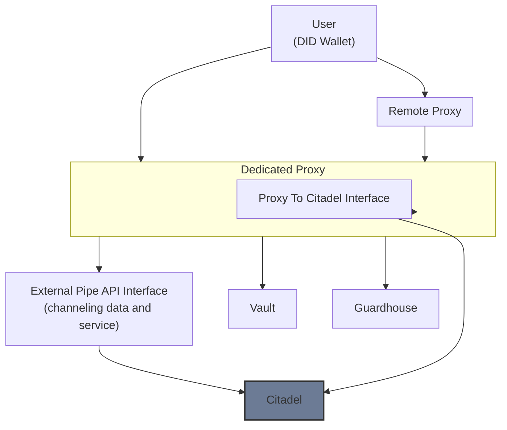

# W2CLA - The way to a Citadel logical architecture

`Way to Citadel Logical Architecture` is an experimental and open source project proposing a protocol for key and shared password fortification.

The goal is to never directly provide sensitive keys and secrets, and to assign each user a strong identity allowing access to data and services (APIs, internal applications, etc.) hosted within a Citadel by passing through dedicated proxies specialized in secure data access and exchange.

This aims to facilitate security, compliance, and granular access management.

## Benefits

- A compromised secret does not endanger the entire organization, rotation and revocation facilitated for each user
- Enhanced traceability, each access can be logged and identified (who, what, when)
- Automated onboarding/offboarding, centralized secret rotation: *new users automatically receive their access through their identity, and upon revocation, all access is instantly removed from a central point*

The ideal goal would be to tend towards an open source system that embraces Zero Trust philosophy while offering an open alternative to proprietary security solutions: providing an accessible solution for entities that want an open and transparent approach to security.

## Technical Architecture

### Local Architecture
A single local vault hosted alongside the Citadel at the entity, eliminating synchronization complexity between multiple instances.

### Proxies
Two types coexist:
- **Local dedicated proxies**: have direct access to the vault and handle primary authentication. In case of failure, the architecture allows automatic failover to another proxy
- **Remote proxies**: must go through dedicated proxies to access secrets, creating a hierarchical trust chain

### Guardhouse
Validation module located alongside the Citadel, allowing dedicated proxies to verify user validity before any action on the Citadel or vault. Remote proxies access this validation through their dedicated proxy intermediary, maintaining the hierarchical trust chain. This module centralizes revocation status and permissions in real-time. In case of failure, no access is possible until restoration. A backup entity can be planned for redundancy.

### Self-Regenerating Guardhouse
In case of complete corruption, the Citadel preserves user metadata (ID and access logs). A supervised reconstruction process allows an administrator to restart the Guardhouse: users are progressively re-added based on their interactions with the Citadel, with the administrator validating or refusing each reintegration via a monitoring interface.

### Citadels
They host either access or directly the services and data shared within the organization. They preserve user metadata necessary for traceability and system regeneration.

### Users
They possess their keychain or wallet with their secrets/keys based on DID (Decentralized Identifiers) standards, allowing interoperability with other W2CLA systems and standardized identity management.

### APIs

### External Pipe API Interface
This Pipe serves as a gateway for data retrieval and transmission between the Citadel service and users. It acts as an intermediary component that channels all data and service requests from proxies to the Citadel, ensuring standardized communication protocols.

### Proxy To Citadel API Interface
Located within dedicated proxies, this interface manages communications between Citadel and proxy via ephemeral authentication:
- The Citadel receives an instruction block and necessary keys with a limited maximum duration
- On output, it initiates an ephemeral connection to the proxy
- Connections automatically invalidate after use, ensuring no persistent sessions remain open

### The Vault
This is where all keys and secrets are carefully stored, accessible only by local dedicated proxies.

## Revocation and Rotation Management

### Revocation
Detected on the next request via the Guardhouse. For large data transfers, the revoked user will receive incomplete chunks that are unusable without final validation.

### Key Rotation
Triggered only during changes to Citadel services/data. Synchronization between vault and Citadel is performed via asymmetric cryptography (shared public/private keys).

### Continuity
Proxies are not immediately notified but discover changes during their next interaction, enabling a resilient and decoupled architecture.

## Core Components

- [w2cla-vault](https://github.com/mcidclan/w2cla-vault)  
  The vault module responsible for secure key and secret storage.

- w2cla-proxy-dedicated  
  Dedicated proxy modules handling primary authentication and direct vault access.

- w2cla-proxy-remote  
  Remote proxies that access secrets via dedicated proxies, establishing a trust hierarchy.

- w2cla-guardhouse  
  The validation module centralizing user status, permissions, and revocation checks.

- w2cla-citadel  
  Hosts services and shared data within the organization, preserving user metadata for traceability.

## System Architecture Overview

**Switch to other languages:**
- [Spécification française](/langs/spec.fr.md)

